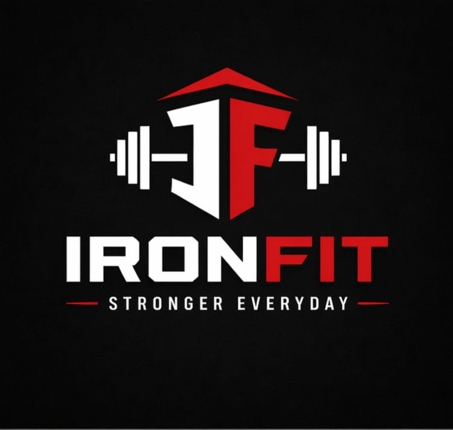

# Gym Business Growth Case Study

## 📌 Objective
Help a local gym improve its online presence and attract more customers.

---

## 🚨 Problem
- Low visibility online  
- No strong branding  
- No engaging social media content  

---

## 💡 Solution
I created a complete AI-assisted digital package:

- Logo design  
- Instagram creatives  
- Promotional video  
- Website landing page concept  

---

## 🧠 My Role
- Business idea planning  
- Content strategy  
- Visual direction  
- AI tool execution  

---

## 🎯 Outcome
- Strong brand identity created  
- Ready-to-use marketing content  
- Improved customer engagement potential  

---

## 📷 Work Preview

### Logo

### Instagram Creatives

### Website Design

